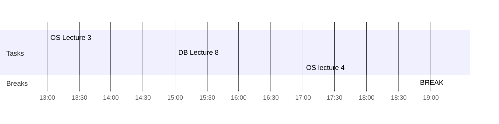

## Day Planner

```mermaid
gantt
    dateFormat  HH-mm
    axisFormat %H:%M
    %% Current Time: 11:59:58 PM
    section Tasks
    OS Lecture 3     :13-00, 120mm
    DB Lecture 8     :15-00, 120mm
    OS lecture 4     :17-00, 135mm
    section Breaks
    BREAK     :19-15, 0mm
```

- [x] 13:00 OS Lecture 3
- [x] 15:00 DB Lecture 8
- [x] 17:00 OS lecture 4
- [x] 19:15 BREAK
