# Preface

Prior to the last two months which saw the adoption of a new *development process* at our company, a vigorous one to three months where put into choosing the set languages, frameworks, techniques, and practices in an effort to streamline the development process. While I had no input on that task and being mainly a recipient of the changes,  I felt for the most part that my considerations were well accounted for, and for that I would like to congratulate and thank the two main instrumentors of the changes  **Ahmad** and **Reem**. 

While an awesome job was done, our field is a one of continuous change and reconsiderations, a field that with the end of every task and after the last key press has been done, one most go back and re-evaluate what has been done up to the current state in a pursuit of spotting a logical, requirement, or even human error in accomplishing the task. This re-evaluation is never really in a chase of perfection, but on the contrary it's due to the common understanding that as developers, nae humans, perfection is never really a feasible goal, thus minimizing the tech debt at every stage is a must. A loss of one hour, one day, one week, or even one month is far more tolerable than continuing to dig an even deeper debt hole.

The main issue I want to tackle in this article is the choice of stack for the backend, which due to my current position and the tasks I'm assigned day to day, has a great effect on me. While I do concur that python has never been my first choice as a language to develop full fledged systems and maintain over time, that's a very known fact about me if I may say, I would like to point out that a great responsibility lays on me if recommendations go through and built upon, that is any lost time, inconveniences, and bottlenecks will be attributed on the most part on me, something I was shielded from by not being part of the team that came instrumented the current changes. Thus being impartial will not only be in the benefit of the company as a whole, but also for me. 


# Type Safety: A Pillar 

## Definition: What Is Type Safety Really?
Well according to [this article](https://www.baeldung.com/cs/type-safety-programming) :

> Type safety in the source code is **a programming language control that ensures that any variable access only its authorized memory locations in a well-defined and permissible way**. In other words, the type safety feature ensures that the code doesn't perform any invalid operation on the underlying object.

that is in layman terms, how well does a programming language prevent miss use of different data types, not allowing the mixing of incompatible data types.

## Importance: And Does It Really Matter?
Glad you asked here are some reasons why its Important:
Here are several reasons why type safety is important in software development:

1. **Error Prevention at Compile Time:** Type safety helps catch type-related errors, such as attempting to use a string operation on a numeric variable, during the compilation phase. This early detection helps in reducing bugs and improving software reliability.
    
2. **Enhanced Code Readability and Maintenance:** Strong typing, which is closely related to type safety, improves code readability by explicitly indicating the expected data types of variables and functions. This clarity aids in understanding code and facilitates easier maintenance and debugging.
    
3. **Increased Robustness and Reliability:** Type safety contributes to a more robust and reliable software system by reducing the likelihood of runtime errors related to type mismatches or incompatible operations. This leads to more stable and predictable behavior of the program.
    
4. **Better Code Quality and Productivity:** By preventing type-related errors early in the development process, developers spend less time debugging and fixing issues, resulting in higher code quality and increased productivity. Developers can focus on designing and implementing functionality rather than chasing down type-related bugs.
    
5. **Enhanced Code Refactoring and Evolution:** Type safety facilitates code refactoring and evolution by providing a safety net when making changes to the codebase. Developers can confidently modify and refactor code, knowing that type errors will be caught and addressed, preserving the system's integrity.
    
6. **Facilitates Collaboration:** Type-safe languages make it easier for multiple developers to collaborate on a project because the code's behavior and requirements are explicitly defined by the types. This reduces misunderstandings and misinterpretations of the codebase.
    
7. **Performance Optimization:** With type safety, the compiler can perform better optimization since it has a clear understanding of the data types being used. This can lead to faster and more efficient code execution.
    
8. **Security Enhancement:** Type safety can enhance security by preventing certain types of vulnerabilities, such as buffer overflows and type confusion attacks, that could be exploited by malicious actors.

## Implementations: Different Implementations Lead To Different Results!
Taking a step back it might seem obvious that since software development is the act of aggregation of business data be it through any means (user input, scraping, predefined data...), mutating said data to accomplish a predefined goal, and then returning the results to be saved and/or presented, type safety for the most part should be the ultimate goal for each and every language. And for the most part yes, but with everything compromises have to be done, decisions that are counter productive are made, and different styles and way of thinking lead to different conclusions. 

### Types

#### Weakly, Dynamically Typed 
The weakly typed part means that a variable's type doesn't for the most part matter when an operation is applied on it where the language interpreter will apply type coercion to ensure that operation is successfull, while the dynamically typed means as previously explained that the type of the variable is only determined on runtime. This can be seen with languages like js, php, and ruby. *Least type safe.*

```js
function someFunction() {
	// this is not really a string now, 
	// but might be at runtime,
	// but doesn't matter 
	const i = "1"; 
	
	// this is not really a number now, 
	// but might be at runtime,
	// but doesn't matter 
	const j = 2;
	console.log(i+j) // this will log 12 as a string
}
```

```js
function someOtherFunction() {
	const x = "something";
	console.log(Number(x)) // this will log Nan but will not error
}
```


#### Strongly, Dynamically Typed
The strongly part means that a variable's type matters for preforming operations, while the dynamically typed means that the variable's type is only determined during runtime. In a nutshell this means that types are not explicitly defined in the code, but implicitly derived from the operations applied upon them. This can be seen in languages like python. *Some how type safe.*


```python
def somefunction():
	# this is not really a string now, 
	# but might be at runtime,
	# and matters if is or not
	i = "1"

	# this is not really a number now, 
	# but might be at runtime,
	# and matters if is or not
	j = 2
	print(i+j)	# This will raise TypeAssertion Error

somefunction()
```


#### Strongly, Statically Typed
As mention before, strongly means that the variable type is important for applying operations, while being explicitly defined at compile time. *The most type safe.*

```go
func SomeFunction() {
	// this is a string now, 
	// also surely is at runtime,
	// and it matters
	var i: int = "1"

	// this is a number now, 
	// also surely is at runtime,
	// and it matters
	var j: string = 2
	
	print(i+j) // this will throw an error
}
```

```ad-warning
Personal Opinion Coming Up:

While one can easily interpret the types of the variables here, and rightfully recognize that the error can be easily sorted out upon the first run of the program, this example does't represent real word scanerios where the spec is a bit more than printing the sum of two variables and the needed work is ussually more than 3 loc.
```

## Counter Arguments
Ofcourse the importance of type safety like anything is not agreed upon by everyone, a great champion of the counter is [DHH](https://dhh.dk) known as the creator of Ruby On Rails prefers the freedom, boilerplate free code, and faster development that dynamic languages bring to the table. 

### Counter, Counter Argument
Although one can't argue that dynamically typed are not less boilerplate heavy, and not easier to develop at first, it's easy to forget that the hardest part of developing a software is not the initial step, but the maintenance and expanding upon the software with time and by different team members throughout the software lifetime.

 
It's a well known fact that rails was an instrumental part in helping these companies build great products over the year, it's also a well known fact that these companies abandoned rails and had to do full rewrites years after when their software, teams, and user base grew.  Since then out of the 18 companies that are using **13** had moved away and only **5** still use it. 

```ad-warning
Personal Opinion Coming Up

As outlined through a chat with **Hussien** on Saturday, September 16, 2023, when discussing Microservices Architecture vs Monolithic Architecture, it was clear that the company's focus was primarly focused on the long run, as a counter to the speed of development that a monolithic architecture might bring to the table with respect to team, software and user size.
```


## Current State: The Pitfalls And Blesses
This section serves no value, if after laying down the facts no evaluation of the current state within the company is done, to mainly:
1) Identify the current.
2) Recognize the current benefits.
3) Recognize the current pitfalls.
4) Extrapolate a biased conclusion.

### Current State
We are currently using python a **dynamically strongly typed** language with type hints and pydantic for model validation. Types are interpolated at runtime with little to none at compile time.

### Benefits
The current state encourages faster code output and less boilerplate, with very little type definition,  and no compilation needed to run the code.

### Pitfalls
The pitfalls of the current state are that it will lead to a less maintainable and clear code on the long run with more bugs do to the lack of static typing and compilation phase. While the benefits have been touched upon throughout our daily tasks, the pitfalls remain obscure since they will mostly be shrugged upon as developer errors especially when interaction with alternatives staticlly typed languages have been very limited within our company, thus I will make a case for some of the pitfalls I have had while developing the MOF backend in the past 50 days.

#### Undefined Attribute Access

A usual and very often error is this one, accessing attributes not defined on a pydantic model is very often and is only picked up at runtime *if* the block of code is actually  ran. The error is not highlighted on any of the IDEs we use at the company.

* Code:
```python
import random

from mof.exceptions import APIException

class DepartmentError(BaseModel):
    """Base class for exceptions in this module."""
    not_found: Annotated[
        ErrorType,
        Field(alias="notFound")
    ]
    name_exists: Annotated[
        ErrorType,
        Field(alias="nameExists")
    ]
    
department_errors: DepartmentError = DepartmentError.model_validate(load_errors('department'))

def throw_error_pydantic_model():  
    error = False  
    i = random.randint(0, 100)  
    if i > 50:  
        error = True  
  
    if error:  
        # department does not exist on department_errors  
        raise APIException(department_errors.department_not_found)  
  
    return "This passed!"
```

* Pycharm:
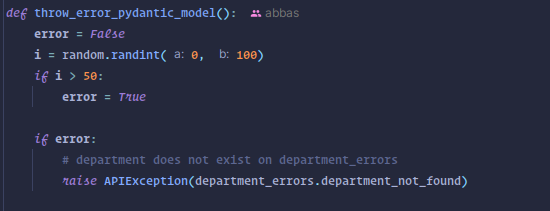

* VSCode:
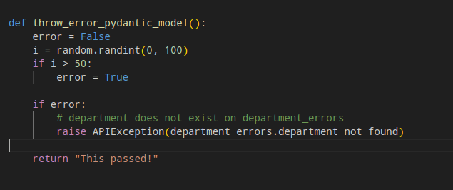

* Output On Error:
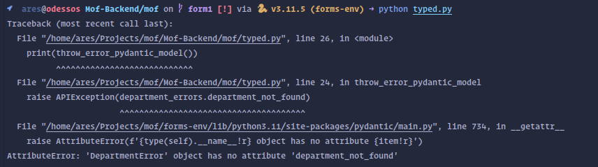

* Output On Success:
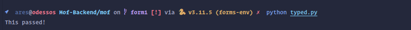

#### No Import 
When accessing a something that is not defined a very expected behavior is to throw an error on runtime and highlight it as an error in the IDE, something that is not at if every run of the program and on every IDE.

```python
def throw_error_no_import():
    error = False
    i = random.randint(0, 100)
    if i > 50:
        error = True

    if error:
        # never imported user_error, does not throw an error if not executed
        raise APIException(user_error.department_not_found)

    return "throw_error_no_import(): This passed!"
```

Pycharm:
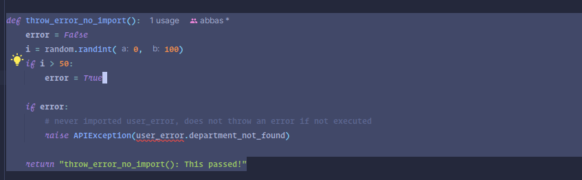

* VSCode:
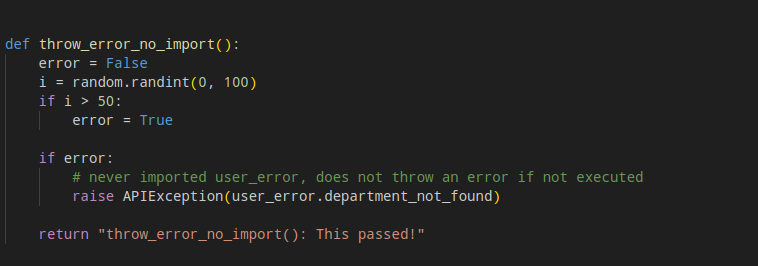

* Output On Error:
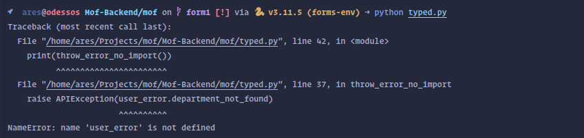

* Output On Success:
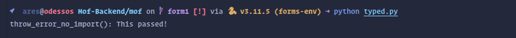

#### No Reliable Guidance
This is nice one, the method `.add_span_processor` exists on the type `TraceProvider` and upon reading the source code it exists! But for some reason it shows as a warning in pycharm but not in vscode and neither provides types for it!

```python
def instrumentation_no_guidance():  
    resource = Resource.create({SERVICE_NAME: "mof"})  
    tracer = TracerProvider(resource=resource)  
    trace.set_tracer_provider(tracer)  
    otlp_exporter = OTLPSpanExporter(endpoint="localhost:4317", insecure=True)  
    span_processor = BatchSpanProcessor(otlp_exporter)  
  
    # span processor exists on trace.get_tracer_provider() TraceProvider Class  
    trace.get_tracer_provider().add_span_processor(span_processor)  
  
    return "instrumentation_no_guidance(): This passed!"
```

* Pycharm: 
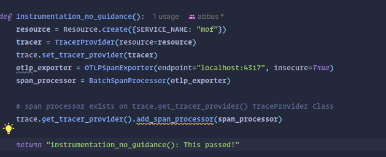

* VSCode:
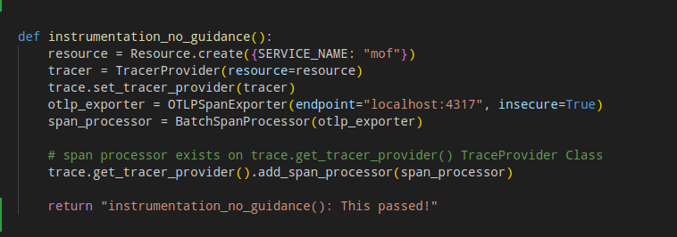

* Output On Error: Couldn't produce

* Output On Success:
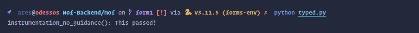

#### Union Types
Union types are unreliable when having an array that can be of multiple types, with mof made mostly of data array, this was a huge foot gun for me! Trying to apply an addition operation which could only happen between values between the same type will throw an error on runtime only if it occurs!

```python
def lists():  
    def pass_something(str_or_num_list: list[str | int]):  
        str_or_num_list.append(1)  # can append an int to str only list!!!
  
    str_list: list[str] = ["a", "b", "c"]  
    # this will append a number to a string only list  
    pass_something(str_list)  
  
    if random.randint(0, 100) > 50:  
        return str_list[2] + str_list[3]  
  
    return "lists(): This passed!"
```

* Pycharm: 


* VSCode:
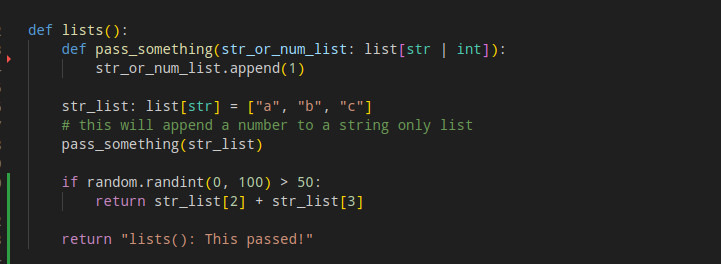

* Output On Error: 
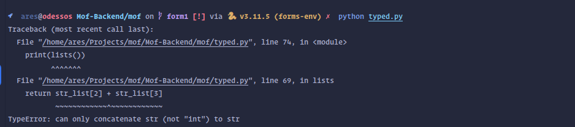

* Output On Success:
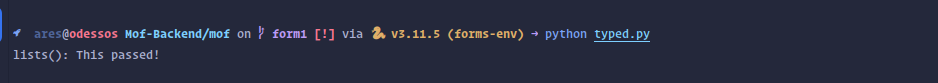


#### Updating A Pydantic Model Attribute With Wrong Type
While upon creation of a pydantic model with raise an error if a value of different type then stated is given, if the model is updated it will not raise an error and on runtime the code block is executed an error is raised, with no ide highlight.

```python
def updating_a_model():
    class Model(BaseModel):
        age: int | None = None

    data = Model()
    # this will not throw an error
    data.age = "1"

    error = False
    i = random.randint(0, 100)
    if i > 50:
        error = True

    # this will not throw an error, instead "11" will be printed out
    if error:
        data.age = data.age * 2
        print(data.age)

    # this will throw an error
    if error:
        data.age = data.age + 1
        print(data.age)

    return "updating_a_model(): This passed!"
```

* Pycharm: 
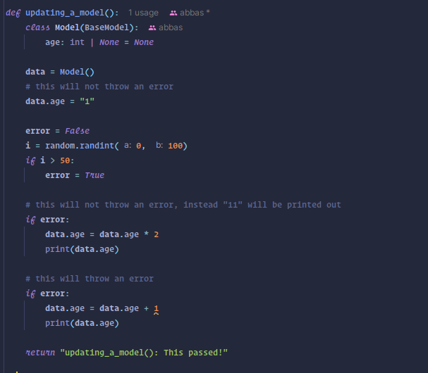

* VSCode:
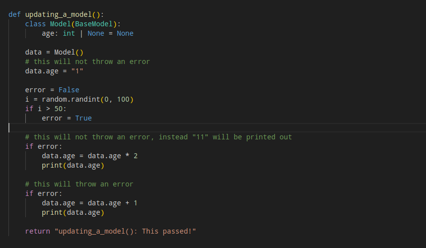

* Output On Error: 
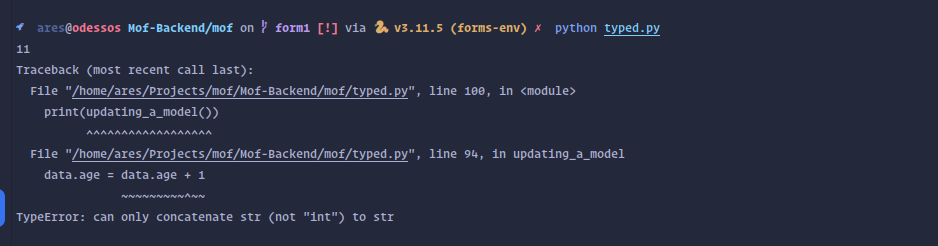

* Output On Success:
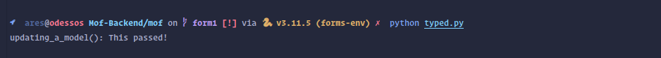


#### Check Settings
Another import mistake this time, warning highlight on pycharm, no error on vscode, and only output an error if the code block specified is excuted.

```python
async def check_settings_imports():  
    error = False  
    i = random.randint(0, 100)  
    if i > 50:  
        error = True  
  
    # never imported settings_service instance from the file  
    # just imported the file does not throw an error    if error:  
        from mof.settings.services import settings_service  
        from mof import logger  
  
        settings = None  
        try:  
            settings = await settings_service.get_settings()  
        except APIException:  
            logger.info("Settings not found. Creating default settings.")  
  
        if not settings:  
            try:  
                dto = CreateSettingsDTO(  
                    **{  
                        "currencies": [  
                            {  
                                "name": "United States Dollar",  
                                "code": "USD",  
                                "defaultRate": float(1.0),  
                                "exchangeRates": [],  
                            }  
                        ]  
                    }  
                )  
                settings = await settings_service.create_settings(dto)  
            except Exception as e:  
                logger.warning(e)  
  
    return "check_settings_imports(): This passed!"
```

* Pycharm: 
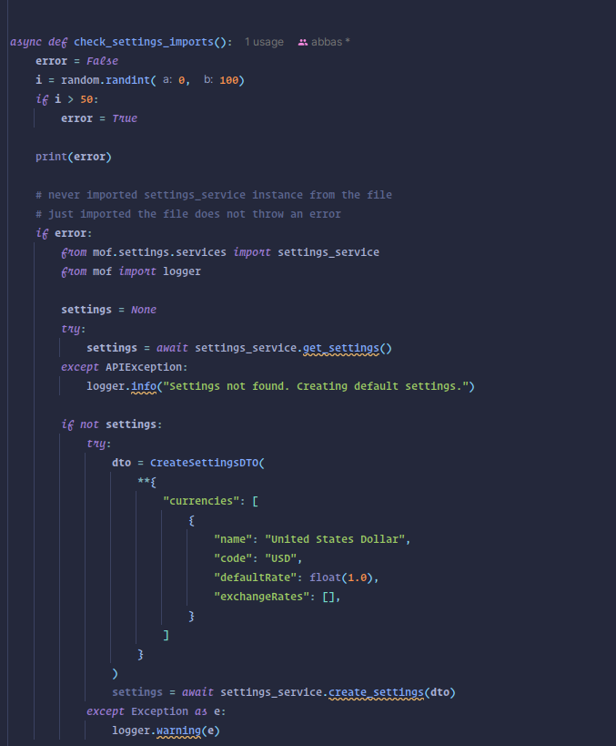

* VSCode:
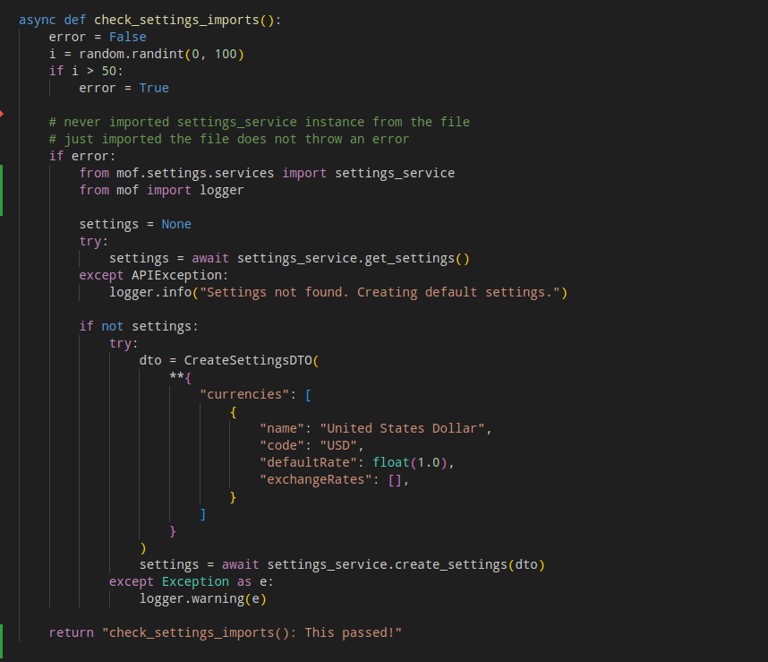

* Output On Error: 
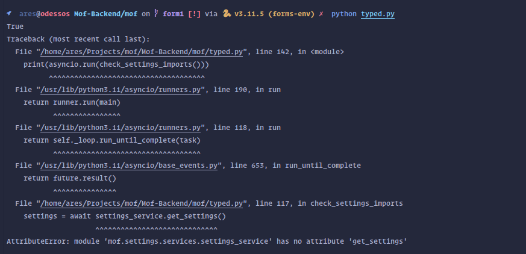

* Output On Success:
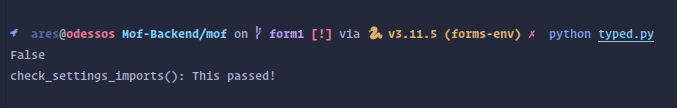


#### Aliases
Since pydantic models are created through a function that doesn't specify strict variables due to the nature and purpose library, this can cause huge issues when there is a need to change a variable name.

```python
def alias_creation():
    # Creating a python model by alias NOICE, this will surely not cause an error in the future
    # when I rename the alias something else
    dto = CreateSettingsDTO(
        **{
            "name": "United States Dollar",
            "code": "USD",
            "defaultRate": float(1.0),
            "exchangeRates": [],
        }
    )

    error = False
    i = random.randint(0, 100)
    if i > 50:
        error = True

    if error:
        # maybe I want to rename defaultRate to something else more descriptive,
        # say defaultExchangeRate? I will not know where it is used!
        dto = CreateCurrencyDTO(
            **{
                "name": "United States Dollar",
                "code": "USD",
                "defaultExchangeRate": float(
                    1.0
                ),  # <--- I will not know where this is used
                "exchangeRates": [],
            }
        )

        # Beanie is also more wacky than pydantic, but I will not mention it here
        # because I don't have time
    return "alias_creation(): This passed!"


```


* Pycharm: 
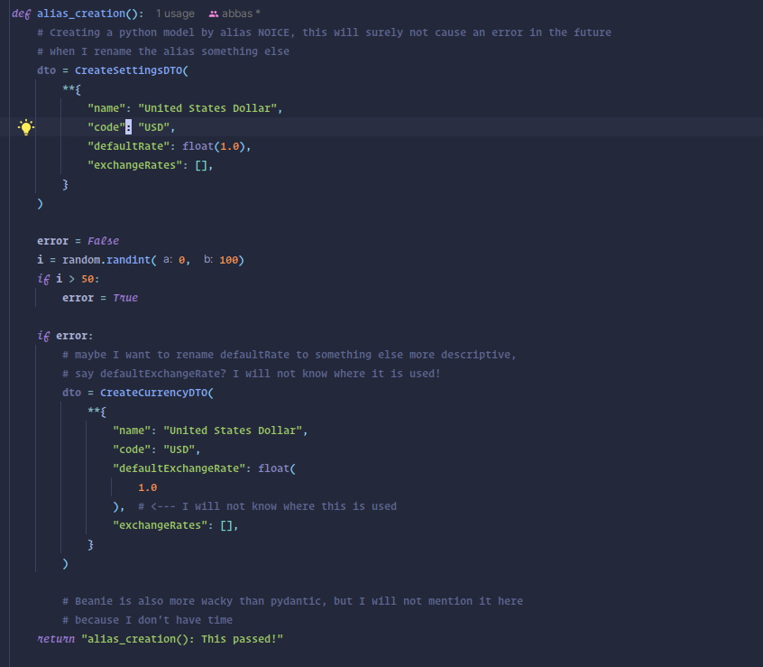

* VSCode:
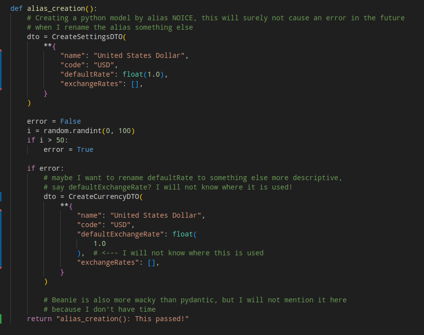

* Output On Error: 
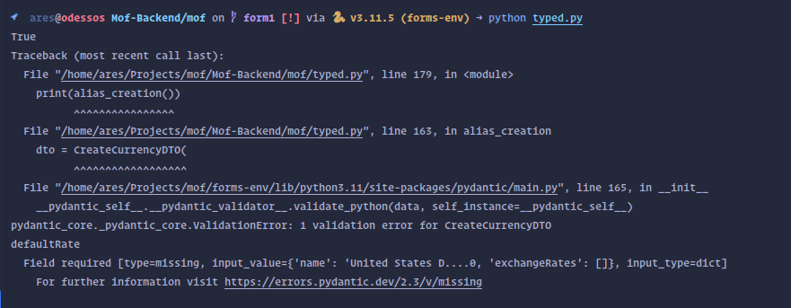

* Output On Success:
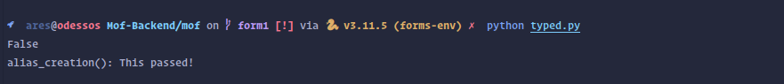


# Anecdotes
## The Current Marketplace 
An aggregation of companies which I personally applied to or have connections in that allows me to have insight on what stacks are using yielded the following results:

# Development Speed: A Bonus Hot Take

## A Definition
In this section I will discuss development speed, a factor not only influenced by a language syntax, but the ecosystem, documentation, and extensibility.

## The Hot Take
Although it might seem that syntax is the biggest deciding factor for speed in development, want might argue a chain is measured by its strength at the weakest of its links. This might be baffling at first, if for the most of my system where all the operations are trivial, and only a small subset is computationally or structurally heavy why would the small subset outweigh the rest? 

The fact is that the difference in time needed to achieve the trivial operations is negligible, between general purpose language. A simple example is the hello world program, for most languages it can be achieved in a matter of couple of seconds, and that requires defining a variable, a function, and using a system util (add to that a class if you're using java). Add to that a couple of if statements and for loops, and that's bread and butter of any program. 

Where the difference lays is when you need to extend that a bit more, both architecturally and computationally take these two examples: 

1) Architecture:
> A media Management service, where a user can upload an image, retrieve, update and delete an image. And the system requires the ability to persist the media to multiple providers, one on GCP Cloud Storage, and another for AWS S3 Bucket.

Its easy at first one might think that a simple if-else will do the job and that's it, yay! Yeah.... no.  Assume that uploading an image requires 50 loc.

```python
def upload_image():
	# .... do some logic to check whether the image should be uploaded to aws or gcp assume 30loc

	if gcp == true:
		# ... upload the image to gcp
		# 50 loc
	else:
		# ... upload the image to aws
		# 50 loc

		# 30 + 50 + 50 = 130 loc !!! in one function
```

That's still manageable, what if instead we had also to add another two options Azure Storage and Persisting to disk maybe for processing if the image is larger than the outlined threshold, this function can grow out of hand quickly!

What if instead we defined a simple interface and define media management classes that encapsulate the logic in one object and through some magic we inject the need class at runtime based on the requirement with a strategy pattern?

```C#
public interface IMediaService
{
    string Username { get; set; }
    string Password { get; set; }

    string Upload(Image image);
	  Image Retrieve(string location);
	  string Update(string location, Image image);
    void Delete(string location);
}
```

```go
type Animal interface {
		getUsername() string;
		getPassword() string;
		
    Upload(image Image) (string, error);
    Retrieve(location string) (Image, error);
    Update(location string, image Image) (string, error);
    Delete(location string) error;
}
```

Now one can just encapsulate all the logic of every provider in a centralized place  based on well defined contract. This can be achieved similarly in python but due to lack of a way to define a strict contract an interface in this case it will be error prune in the future if someone lets say forgets to implement the Update method. 

2) 
> Assume we a data pipeline where we ingest non trivial amount of data serialize it, do some computation send it back someone else.

The performance overhead will grow especially during the time between the GC is absent, and at times it is present, which will lead to higher latency. 
I'd argue that implementing the least performant version that meets the spec, would be far more easier in something like `GO` or `C#` over say `python` or `typescript`.